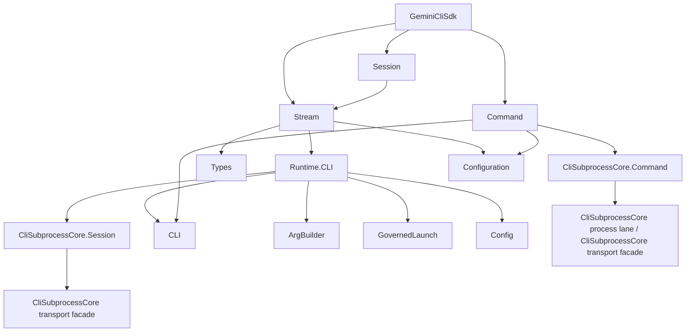

# Architecture

This guide explains the internal architecture of GeminiCliSdk for contributors and advanced users.

## Module Hierarchy



## Data Flow

### Streaming Execution

```
User Code
  |
  v
GeminiCliSdk.execute/2          -- validates direct or governed options
  |
  v
Stream.execute/2                -- returns Stream.resource/3
  |
  v
Runtime.CLI.start_session/1     -- resolves standalone CLI or authority launch
  |                                starts a CliSubprocessCore.Session
  v
CliSubprocessCore.Session       -- shared common CLI session engine
  |
  v
CliSubprocessCore transport facade -- shared local session transport seam
  |
  v
gemini CLI process              -- emits JSONL to stdout
  |
  v
CliSubprocessCore.Session       -- decodes Gemini profile events
  |
  v
Runtime.CLI.project_event/2     -- projects core events into Gemini public structs
  |
  v
Stream.receive_next/1           -- selective receive, timeout handling, cleanup
  |
  v
User's Enum/Stream consumer     -- processes events lazily
```

Governed runs use the SDK governed launch adapter to materialize command, cwd,
environment, target, command, credential lease, and redaction references from
the supplied authority. In that mode the runtime rejects standalone CLI
discovery, explicit command overrides, settings-backed `.gemini` roots, cwd
overrides, execution-surface overrides, env overrides, and model-payload env
overrides.

### Synchronous Execution

```
GeminiCliSdk.run/2
  |
  v
GeminiCliSdk.execute/2          -- creates stream
  |
  v
Enum.reduce/3                   -- collects assistant text
  |
  v
{:ok, text} | {:error, %Error{}}
```

## Key Modules

### `GeminiCliSdk` (Public API)

The top-level module is a small delegating public API. It provides:

- `execute/2` -- streaming execution
- `run/2` -- synchronous execution
- `list_sessions/1`, `resume_session/3`, `delete_session/2` -- session management
- `version/0` -- CLI version

### `GeminiCliSdk.Stream`

The stream module still uses `Stream.resource/3`, but it now delegates session
ownership to the shared core lane.

Its main responsibilities are:

1. **start_fn**: Starts `GeminiCliSdk.Runtime.CLI`, subscribes to the scoped core session event stream, and closes stdin for prompt-driven runs.
2. **next_fn**: Does selective receive on that session's internal runtime events, captures stderr, projects public Gemini events, and enforces idle timeouts.
3. **after_fn**: Closes the core session, flushes leftover mailbox messages, and cleans up temporary settings files.

The stream keeps the runtime-owned session tag inside its internal state and
does not expose the raw core tag as public Gemini caller vocabulary.

### `GeminiCliSdk.Runtime.CLI`

This is the Gemini runtime kit above `CliSubprocessCore.Session`.

It is responsible for:

- preserving Gemini CLI command resolution, including explicit `cli_command`,
  PATH lookup, npm global lookup, and npx fallback
- preserving Gemini option-to-flag shaping for the public SDK surface
- starting the shared core session runtime
- projecting normalized core events back into `GeminiCliSdk.Types.*`

The runtime kit uses a small Gemini invocation profile for command
construction only. Parsing, event normalization, and subprocess ownership
remain core-owned.

### `GeminiCliSdk.Types`

Defines the 6 public event structs and the `parse_event/1` helper used by the
public projection layer. `final_event?/1` still identifies stream-ending
events for the public Gemini surface.

### `GeminiCliSdk.CLI`

Resolves the `gemini` binary location using a 4-strategy waterfall:

1. explicit `cli_command`, `command`, `executable`, or `command_spec`
2. `gemini` on system `PATH` (globally installed)
3. npm global bin directory (`npm prefix -g`/bin/gemini)
4. `npx` fallback (`npx --yes --package @google/gemini-cli gemini`)

Returns a `CommandSpec` with `program` and `argv_prefix` (used by the npx
strategy to prepend `["--yes", "--package", "@google/gemini-cli", "gemini"]`).

### `GeminiCliSdk.ArgBuilder`

Converts an `Options` struct into Gemini CLI arguments. After the replatform it
is no longer part of a Gemini-owned transport/runtime stack; it is only used by
`GeminiCliSdk.Runtime.CLI` to preserve Gemini-specific invocation semantics
above the shared core session engine.

### `GeminiCliSdk.Config`

Handles temporary runtime workspaces. When `Options.settings` is set, it writes
`.gemini/settings.json` to a temp directory, which is cleaned up after the
stream completes.

### `GeminiCliSdk.Command`

Synchronous command runner for non-streaming operations (list sessions, delete
session, version). It now builds Gemini-specific invocations locally and
executes them through `CliSubprocessCore.Command.run/2`.

### `GeminiCliSdk.Models`

Single source of truth for model names. Provides `default_model/0`, `fast_model/0`, alias resolution, and validation. All model references in the SDK flow through this module. See the [Models guide](models.md).

### `GeminiCliSdk.Configuration`

Centralizes all numeric constants (timeouts, buffer sizes, limits). Every internal module reads its constants from here. Supports runtime override via `Application.get_env/3`. See the [Configuration guide](configuration.md).

## OTP Integration

`cli_subprocess_core` starts the shared `Task.Supervisor` and provider registry
used by the core session lane and command/runtime layers.

GeminiCliSdk keeps its own OTP application module for SDK-local processes and
backwards-compatible application startup.

## Error Architecture

Errors flow through two paths:

1. **Stream path**: Errors become `Types.ErrorEvent` structs in the event stream
2. **Command path**: Errors become `{:error, %Error{}}` tuples

Core runtime errors are projected back into Gemini `Types.ErrorEvent` values so
callers do not need to adopt the normalized core event vocabulary.
The Gemini event structs remain the ergonomic public surface, while the stream
parser now treats `Zoi` as the source of truth for validation/normalization and
stores unknown fields in `extra` for forward-compatible projection.
