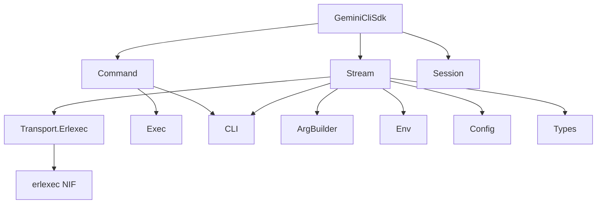

# Architecture

This guide explains the internal architecture of GeminiCliSdk for contributors and advanced users.

## Module Hierarchy



## Data Flow

### Streaming Execution

```
User Code
  |
  v
GeminiCliSdk.execute/2          -- validates options
  |
  v
Stream.execute/2                -- returns Stream.resource/3
  |
  v
Stream.start/2                  -- resolves CLI, builds args/env
  |                                creates transport, sends prompt
  v
Transport.Erlexec               -- GenServer managing erlexec
  |
  v
erlexec (NIF)                   -- spawns OS process with process groups
  |
  v
gemini CLI process              -- emits JSONL to stdout
  |
  v
Transport.Erlexec               -- line buffers stdout, emits tagged messages
  |
  v
Stream.receive_next/1           -- selective receive, parses JSON
  |
  v
Types.parse_event/1             -- converts to typed structs
  |
  v
User's Enum/Stream consumer     -- processes events lazily
```

### Synchronous Execution

```
GeminiCliSdk.run/2
  |
  v
GeminiCliSdk.execute/2          -- creates stream
  |
  v
Enum.reduce/3                   -- collects assistant text
  |
  v
{:ok, text} | {:error, %Error{}}
```

## Key Modules

### `GeminiCliSdk` (Public API)

The top-level module is a thin facade that delegates to internal modules. It provides:

- `execute/2` -- streaming execution
- `run/2` -- synchronous execution
- `list_sessions/1`, `resume_session/3`, `delete_session/2` -- session management
- `version/0` -- CLI version

### `GeminiCliSdk.Stream`

The stream module uses `Stream.resource/3` with three callbacks:

1. **start_fn**: Resolves the CLI binary, builds args and env, starts the transport GenServer, sends the prompt to stdin, and closes stdin.
2. **next_fn**: Does selective receive on `{:gemini_sdk_transport, ref, event}` messages, parses JSONL lines, and yields typed event structs.
3. **after_fn**: Force-closes the transport, flushes leftover messages from the mailbox, and cleans up any temporary settings files.

### `GeminiCliSdk.Transport.Erlexec`

A GenServer that wraps the erlexec library. Key responsibilities:

- Spawns the OS process via `:exec.run/2`
- Buffers stdout line-by-line (splits on `\n`, flushes partial lines on exit)
- Captures stderr into a capped ring buffer
- Delivers events to subscribers via tagged messages: `{:gemini_sdk_transport, ref, event}`
- Manages graceful shutdown (SIGTERM then SIGKILL)
- Handles headless timeout (auto-stop if no subscriber connects within 5 seconds)

### `GeminiCliSdk.Types`

Defines the 6 event structs and the `parse_event/1` function that converts raw JSON maps into typed structs. Also provides `final_event?/1` to detect stream-ending events.

### `GeminiCliSdk.CLI`

Resolves the `gemini` binary location. Checks `GEMINI_CLI_PATH` environment variable first, then falls back to `System.find_executable/1`.

### `GeminiCliSdk.ArgBuilder`

Converts an `Options` struct into a list of CLI arguments. Each option maps to a specific CLI flag.

### `GeminiCliSdk.Env`

Builds the subprocess environment by filtering the current system env (passing through `GEMINI_*` and `GOOGLE_*` prefixed variables) and merging user overrides.

### `GeminiCliSdk.Config`

Handles temporary settings files. When `Options.settings` is set, it writes a `settings.json` to a temp directory, which is cleaned up after the stream completes.

### `GeminiCliSdk.Command`

Synchronous command runner for non-streaming operations (list sessions, delete session, version). Uses `:exec.run/2` directly and collects output.

## OTP Integration

The application starts a `Task.Supervisor` named `GeminiCliSdk.TaskSupervisor`, used for async I/O operations (sending stdin, closing stdin) in the transport layer.

## Error Architecture

Errors flow through two paths:

1. **Stream path**: Errors become `Types.ErrorEvent` structs in the event stream
2. **Command path**: Errors become `{:error, %Error{}}` tuples

Exit codes from the CLI are mapped to error kinds via `Error.from_exit_code/1`.
